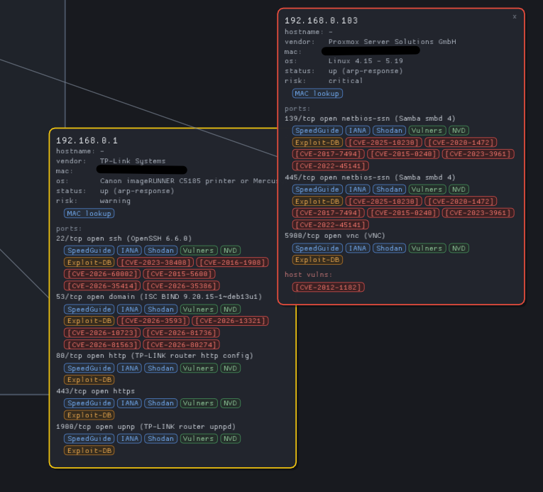

[English](README.md) | [Polski](README.pl.md)

# VNM – Visual Network Mapper

Native desktop tool for network engineers, pentesters and homelabs. A flat,
readable 2D view of network topology (nodes, `/24` subnets, security status)
built on top of Nmap scan results.

> **Status:** `v0.6.2` – native core (engine + CLI), SQLite history + diffing, a
> native 2D GUI (Dear ImGui docking), **Windows + Linux** support, **passive
> discovery** (ARP/DHCP) and **SVG/PNG/JSON export**.


## Why

- **Fast native startup** and low memory use (a single C++ binary).
- A **single binary** on Linux and Windows, no Node.js / Python / Docker.
- **Live 2D topology map** built from Nmap scans and updated *while scanning*:
  hosts placed **radially around the gateway**, `/24` subnet frames, draggable
  nodes.
- Click a host for a **detail card** with its ports and **clickable reference
  links** (port info, vulnerability search, CVE, MAC vendor lookup).
- **Passive discovery** (ARP/DHCP), **SQLite history + diffing**, verbose live
  log, and **SVG/PNG/JSON export**.



## Requirements

### Linux

- C++20 compiler (GCC 13+ or Clang 16+)
- CMake ≥ 3.20
- `nmap` in `PATH` (scanning)
- Optional: `setcap` for OS detection / SYN scans
- GUI: GLFW 3.3+ and OpenGL (Dear ImGui is fetched via CMake FetchContent on
  first GUI configure, so a network connection is needed once)
- Passive discovery: `libpcap` (auto-detected). Grant capabilities once with
  `sudo ./scripts/setcap.sh` so capture works without running as root.

### Windows

- To **run** the prebuilt binary: nothing but Nmap (below).
- To **build** from source: MSVC 2022 and CMake ≥ 3.20.
- **Nmap for Windows** (bundles the Npcap driver):
  <https://nmap.org/download.html>
- **Npcap** driver — installed by the Nmap installer; if not, get it at
  <https://npcap.com/#download>
- Run as **Administrator** for `-sS`/`-O`/ARP scans, otherwise use a connect
  scan (`-sT`)
- GUI: GLFW/OpenGL (Dear ImGui and the Npcap SDK are fetched at build time)

## Build on Linux

Install dependencies and configure the environment (once, requires sudo):

```sh
sudo ./scripts/setup-dev.sh
```

Build and test:

```sh
cmake -S . -B build/debug -DCMAKE_BUILD_TYPE=Debug
cmake --build build/debug -j
ctest --test-dir build/debug --output-on-failure
```

## Windows: download & run

No build required — use the prebuilt `.exe`:

1. **Install Nmap for Windows** (includes the Npcap driver) from
   <https://nmap.org/download.html>. Keep the **Npcap** component selected in
   the installer (or install Npcap separately from <https://npcap.com/#download>).
2. **Download the release** `vnm-windows-x86_64.zip` from
   <https://github.com/brodatech-lab/vnm-visual-network-mapper/releases> and
   unzip it.
3. **Run** `vnm_gui.exe` (double-click) — or `vnm.exe` from a terminal.
4. **Windows SmartScreen** may warn because the binary is unsigned: click
   **More info → Run anyway**.
5. For SYN/OS/ARP scans, right-click the app → **Run as administrator** (or
   install Npcap with non-admin capture enabled).

## Build on Windows

With Visual Studio 2022 (MSVC) and CMake:

```powershell
cmake -S . -B build -G "Visual Studio 17 2022" -A x64 -DVNM_BUILD_GUI=ON
cmake --build build --config Release --parallel
# binaries: build\Release\vnm.exe and build\src\ui\Release\vnm_gui.exe
```

(or use the `windows-msvc` preset). Prebuilt `.exe`/Linux binaries are produced
by the GitHub Actions release workflow on version tags.

## Usage (CLI)

```sh
./build/debug/vnm interfaces              # local interfaces + default gateway
./build/debug/vnm scan 192.168.0.0/24     # run nmap, print and store hosts
./build/debug/vnm parse scan.xml --save   # parse an Nmap XML file and store it
./build/debug/vnm layout scan.xml         # compute 2D subnet clusters
./build/debug/vnm history                 # list stored scans
./build/debug/vnm show 1                  # print a stored scan
./build/debug/vnm diff 1 2                # compare two scans (time travel)
./build/debug/vnm sniff --seconds 10      # passive ARP/DHCP discovery
./build/debug/vnm export scan.xml --format svg --out map.svg   # export the map
```

`scan` options: `--os`, `--no-service`, `--scripts` (`-sC`), `--vuln`
(`--script default,vuln`), `--no-save`, `--nmap <path>`, `-T<n>`, `--arg <value>`.

Default database: `~/.config/vnm/storage.db` (override with `VNM_DB`).

## GUI (2D map)

Build with `-DVNM_BUILD_GUI=ON` and launch `vnm_gui`:

```sh
cmake -S . -B build/debug -DVNM_BUILD_GUI=ON
cmake --build build/debug -j
./build/debug/src/ui/vnm_gui                 # empty canvas
./build/debug/src/ui/vnm_gui scan.xml        # load an Nmap XML file
./build/debug/src/ui/vnm_gui map.json        # load an exported JSON map
./build/debug/src/ui/vnm_gui --id 1          # load scan #1 from the database
./build/debug/src/ui/vnm_gui --scan 192.168.0.1/24   # start a scan immediately
```

- **Canvas** – pan & zoom, fit to view, radial layout around the gateway,
  `/24` subnet frames that follow the nodes, minimap with viewport, status
  colours. Host nodes are **draggable**; click one to open a persistent
  **detail card** (also draggable, multiple at once, closed with **×**).
- **Inspector** – host details and a ports table with reference links.
- **Scan** – runs `nmap` in the background only after you press **Scan**
  (target, `-sV`, `-O`, `-sC`, `--script vuln`, timing; **Cancel** + verbose
  log). The map is **built live** while scanning.
- **Data** – load from Nmap XML / JSON / the database; export to
  **SVG / PNG / JSON**; set the browser command.
- **Passive** – ARP/DHCP discovery (needs capabilities); **Merge to map**.
- **Log** – human-readable nmap output.

Reference links on the cards/Inspector open in a real browser (firefox/chromium
detected on `PATH`, override with `VNM_BROWSER` or the **Browser** field); the
exact command is written to the Log.

## Architecture

```
include/vnm/        public API headers
src/core/           GUI-independent core
  model.cpp         data model + risk assessment
  net.cpp           interface detection (getifaddrs / GetAdaptersAddresses)
  scan.cpp          nmap runner (POSIX fork/exec or Windows CreateProcess)
  parse.cpp         dependency-free Nmap XML parser
  layout.cpp        /24 subnet clustering + radial layout around the gateway
  diff.cpp          scan comparison (added/removed/changed)
  storage.cpp       SQLite backend (scans/hosts/ports) + history
  platform.cpp      portable helpers (process id)
  passive.cpp       passive discovery (libpcap) + ARP/DHCP decoders
  links.cpp         reference links (SpeedGuide/IANA/Shodan/Vulners/NVD/…)
  live.cpp          streamed nmap-output parser (live map)
  export.cpp        SVG / PNG / JSON export
  json.cpp          JSON import
src/cli/main.cpp    CLI bootstrap
src/ui/             native 2D GUI (GLFW + OpenGL3 + Dear ImGui docking)
  main.cpp          app, docking layout, panels, link opening
  topology_view.cpp 2D canvas (pan/zoom, drag, cards, minimap)
tests/              unit tests (CTest)
third_party/stb/    bundled stb_image_write + stb_easy_font
```

`vnm_core` (static library) has no GUI dependencies, so it is testable in
isolation and can be reused by both the CLI and the GUI.

## License

Released under the **GNU General Public License v3.0** — see [LICENSE](LICENSE).
