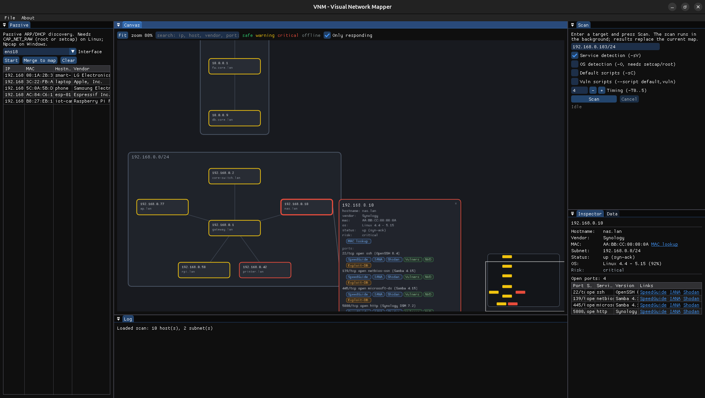

[English](README.md) | [Polski](README.pl.md)

# VNM – Visual Network Mapper

Natywne narzędzie desktopowe dla inżynierów sieciowych, pentesterów i homelabów.
Płaski, czytelny podgląd 2D topologii sieci (węzły, podsieci `/24`, statusy
bezpieczeństwa) oparty na wynikach skanowania Nmapa.

> **Status:** `v0.6.1` – natywny rdzeń (silnik + CLI), historia + diffing na
> SQLite, natywne GUI 2D (Dear ImGui docking), wsparcie **Windows + Linux**,
> **pasywne wykrywanie** (ARP/DHCP) oraz **eksport SVG/PNG/JSON**.



## Dlaczego

- **Szybki natywny start** i niskie zużycie RAM (jedna binarka C++).
- **Jedna binarka** na Linuksa i Windowsa, bez Node.js / Pythona / Dockera.
- **Mapa topologii 2D na żywo** budowana ze skanów Nmapa i aktualizowana
  *w trakcie skanowania*: hosty **radialnie wokół bramy**, ramki podsieci `/24`,
  przeciągalne węzły.
- Klik w hosta → **karta szczegółów** z portami i **klikalnymi linkami
  referencyjnymi** (info o porcie, wyszukiwarka podatności, CVE, vendor po MAC).
- **Pasywne wykrywanie** (ARP/DHCP), **historia SQLite + diffing**, verbose log
  oraz **eksport SVG/PNG/JSON**.

## Wymagania

- Kompilator C++20 (GCC 13+ / Clang 16+ na Linuksie; MSVC 2022 na Windows)
- CMake ≥ 3.20
- `nmap` w `PATH` (skanowanie)
- Linux: opcjonalnie `setcap` dla detekcji OS / skanów SYN
- Windows: **Nmap for Windows** (zawiera Npcap); uruchamiaj jako Administrator
  dla `-sS`/`-O`/ARP, w przeciwnym razie użyj connect scan (`-sT`)
- GUI: GLFW 3.3+ oraz OpenGL (Dear ImGui pobierany przez CMake FetchContent przy
  pierwszej konfiguracji GUI – wymaga jednorazowo sieci)
- Pasywne wykrywanie (Linux): `libpcap` (auto-detekcja). Nadaj jednorazowo
  uprawnienia przez `sudo ./scripts/setcap.sh`, by przechwytywanie działało bez
  uruchamiania jako root.
- Pasywne wykrywanie (Windows): zainstaluj sterownik **Npcap** (SDK Npcap jest
  pobierany automatycznie na etapie build); uruchamiaj jako Administrator

## Szybki start (Linux)

Instalacja zależności i konfiguracja środowiska (raz, wymaga sudo):

```sh
sudo ./scripts/setup-dev.sh
```

Budowa i testy:

```sh
cmake -S . -B build/debug -DCMAKE_BUILD_TYPE=Debug
cmake --build build/debug -j
ctest --test-dir build/debug --output-on-failure
```

## Budowa na Windows

Z Visual Studio 2022 (MSVC) i CMake:

```powershell
cmake -S . -B build -G "Visual Studio 17 2022" -A x64 -DVNM_BUILD_GUI=ON
cmake --build build --config Release --parallel
# binarki: build\Release\vnm.exe oraz build\src\ui\Release\vnm_gui.exe
```

(albo preset `windows-msvc`). Gotowe `.exe`/binarki Linuksa produkuje workflow
GitHub Actions przy tagach wersji.

## Użycie (CLI)

```sh
./build/debug/vnm interfaces              # interfejsy lokalne + brama domyślna
./build/debug/vnm scan 192.168.0.0/24     # uruchom nmap, wypisz i zapisz hosty
./build/debug/vnm parse scan.xml --save   # parsuj wynik Nmap XML i zapisz
./build/debug/vnm layout scan.xml         # przelicz klastry podsieci 2D
./build/debug/vnm history                 # lista zapisanych skanów
./build/debug/vnm show 1                  # wypisz zapisany skan
./build/debug/vnm diff 1 2                # porównaj dwa skany (time travel)
./build/debug/vnm sniff --seconds 10      # pasywne wykrywanie ARP/DHCP
./build/debug/vnm export scan.xml --format svg --out map.svg   # eksport mapy
```

Opcje `scan`: `--os`, `--no-service`, `--scripts` (`-sC`), `--vuln`
(`--script default,vuln`), `--no-save`, `--nmap <path>`, `-T<n>`, `--arg <value>`.

Baza danych domyślnie: `~/.config/vnm/storage.db` (nadpisanie przez `VNM_DB`).

## GUI (mapa 2D)

Zbuduj z `-DVNM_BUILD_GUI=ON` i uruchom `vnm_gui`:

```sh
cmake -S . -B build/debug -DVNM_BUILD_GUI=ON
cmake --build build/debug -j
./build/debug/src/ui/vnm_gui                 # pusty canvas
./build/debug/src/ui/vnm_gui scan.xml        # wczytaj plik Nmap XML
./build/debug/src/ui/vnm_gui map.json        # wczytaj zapisany JSON mapy
./build/debug/src/ui/vnm_gui --id 1          # wczytaj skan #1 z bazy
./build/debug/src/ui/vnm_gui --scan 192.168.0.1/24   # od razu uruchom skan
```

- **Canvas** – pan & zoom, dopasowanie widoku, układ radialny wokół bramy,
  ramki podsieci `/24` podążające za węzłami, minimapa z prostokątem widoku,
  kolory statusów. Węzły są **przeciągalne**; klik otwiera trwałą **kartę
  szczegółów** (też przeciągalną, wiele naraz, zamknięcie przez **×**).
- **Inspector** – szczegóły hosta i tabela portów z linkami.
- **Scan** – uruchamia `nmap` w tle dopiero po kliknięciu **Scan** (cel, `-sV`,
  `-O`, `-sC`, `--script vuln`, timing; **Cancel** + verbose log). Mapa
  **buduje się na żywo** podczas skanu.
- **Data** – wczytywanie z XML / JSON / bazy; eksport do **SVG / PNG / JSON**;
  ustawienie komendy przeglądarki.
- **Passive** – wykrywanie ARP/DHCP (wymaga uprawnień); **Merge to map**.
- **Log** – czytelny output nmapa.

Linki referencyjne na kartach/Inspectorze otwierają się w prawdziwej
przeglądarce (firefox/chromium wykrywane z `PATH`, nadpisanie przez
`VNM_BROWSER` lub pole **Browser**); dokładna komenda trafia do Logu.

## Architektura

```
include/vnm/        publiczne nagłówki API
src/core/           rdzeń niezależny od GUI
  model.cpp         model danych + ocena ryzyka
  net.cpp           detekcja interfejsów (getifaddrs / GetAdaptersAddresses)
  scan.cpp          runner nmap (POSIX fork/exec lub Windows CreateProcess)
  parse.cpp         bezzależnościowy parser XML Nmapa
  layout.cpp        klastrowanie /24 + układ radialny wokół bramy
  diff.cpp          porównywanie skanów (added/removed/changed)
  storage.cpp       backend SQLite (scans/hosts/ports) + historia
  platform.cpp      przenośne helpery (process id)
  passive.cpp       pasywne wykrywanie (libpcap) + dekodery ARP/DHCP
  links.cpp         linki referencyjne (SpeedGuide/IANA/Shodan/Vulners/NVD/…)
  live.cpp          parser strumienia nmapa (mapa na żywo)
  export.cpp        eksport SVG / PNG / JSON
  json.cpp          import JSON
src/cli/main.cpp    bootstrap CLI
src/ui/             natywne GUI 2D (GLFW + OpenGL3 + Dear ImGui docking)
  main.cpp          aplikacja, docking, panele, otwieranie linków
  topology_view.cpp canvas 2D (pan/zoom, przeciąganie, karty, minimapa)
tests/              testy jednostkowe (CTest)
third_party/stb/    dołączone stb_image_write + stb_easy_font
```

`vnm_core` (biblioteka statyczna) nie ma zależności GUI, dzięki czemu jest
testowalna w izolacji i może być użyta zarówno przez CLI, jak i GUI.

## Licencja

Wydane na **GNU General Public License v3.0** — patrz [LICENSE](LICENSE).
